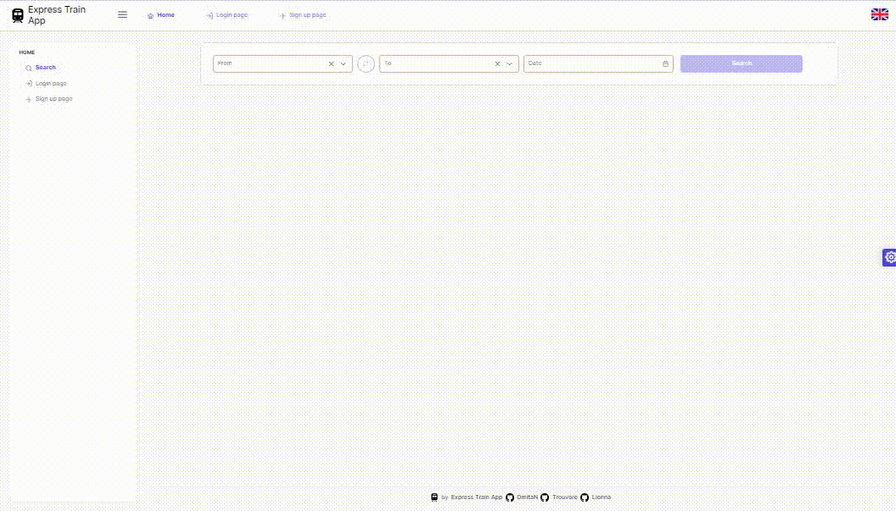

# Express-train-app

## Documentation

For more information, check out the [Presentation](doc/Presentation.pptx)

<details>
<summary>About developers and Teamwork:</summary>

<h1 align="center">Hi 👋 Meet the team behind this project:</h1>

| [](https://github.com/DmitaN) | [](https://github.com/Trouvere) | [](https://github.com/lionna) |
| :---------------------------------------------------------------------------------------------------------: | :-------------------------------------------------------------------------------------------------------------: | :---------------------------------------------------------------------------------------------------------: |
|                                     [DmitaN](https://github.com/DmitaN)                                     |                                     [Trouvere](https://github.com/Trouvere)                                     |                                     [Lionna](https://github.com/lionna)                                     |
|                                                  Tech Lead                                                  |                                                Senior Developer                                                 |                                                  Team Lead                                                  |
|                                                                                                             |

## 💼 Team Member Contributions

- ⚡ **[DmitaN](https://github.com/DmitaN)**

  - Role: Tech Lead
  - Responsible for solving technical issues, ensuring that complex problems were addressed promptly and effectively.

- ⚡ **[Trouvere](https://github.com/Trouvere)**

  - Role: Senior Developer
  - Managed the interaction between various system components and handled state management using Redux.

- ⚡ **[Lionna](https://github.com/lionna)**

  - Role: Lead
  - Focused on fostering a positive team atmosphere, designing the application, and leading the testing efforts to ensure quality and usability.

## Team Working Process

1. **Task Management**  
   We used a shared Google Excel file to register tasks, set priorities, assign team members, and estimate the completion times.

2. **Discussions**  
   All discussions and quick communication were managed in a dedicated Discord channel.

3. **Meetings**  
   We held regular meetings on Google Meet every few days to discuss progress, address issues, and plan upcoming tasks.

4. **Code Collaboration**  
   All code contributions were made through pull requests on GitHub, followed by thorough code reviews to maintain quality and ensure consistency across the project.

</details>
<details>
<summary>About Express-Train-App:</summary>

# Train Trip Management Platform

This project is a group final assignment for the Angular 18 course at app.rs.school.

## Project Overview

- **Technical Requirements**

This project is a robust train ticket booking system designed to facilitate the management and booking of train rides. It offers essential functionalities for handling train schedules, including:

- **Creating, Updating, and Deleting Rides:** Efficiently manage ride details and availability.
- **Managing Arrival and Departure Times:** Ensure accurate scheduling and timing for each trip.
- **User Roles and Permissions**: Support for multiple user roles, including regular users and managers. Users can view and manage their own orders, while managers have additional capabilities to oversee and manage all orders.
- **Ticket Booking System**: Users can search for rides, view detailed trip information, and book seats. The system currently supports booking only one ticket per transaction.
- **Order Management**: Users can view their past and upcoming orders. Managers can view and manage all orders, including the ability to cancel any active order.

The system provides a seamless experience for users and administrators alike:

- **Users** can:

  - Search for available rides.
  - View comprehensive details about trips.
  - Book seats on their chosen rides.
  - Manage their own orders, including viewing past and upcoming trips.

- **Managers** have additional capabilities:
  - **Access and Oversee All Orders**: Managers can view all orders within the system, regardless of the owner. This includes detailed information about each order, including user details and order status.
  - **Manage and Cancel Orders**: Managers have the authority to manage and cancel any active orders. They can initiate cancellations for any orders and handle necessary adjustments or updates to the order status.
  - **Order Cancellation**: Managers can cancel any active order by confirming the cancellation through a dialog that displays the order ID and customer name. The system updates the order status to "cancelled" and provides a success message to confirm the action.
  - **Order Status Monitoring**: Managers can track and monitor the status of all orders, ensuring proper management and resolution of any issues that may arise with active or past orders.
  - **Carriage Management**: Managers can add, update, or remove carriages. This includes setting parameters such as the number of rows, left and right seats, and carriage type.
  - **Ride Management**: Managers can create, modify, or delete ride schedules. They have the ability to adjust arrival and departure times, set dynamic pricing, and manage ride details.
  - **Route Management**: Managers can define and edit routes. This includes specifying stations, the order of stops, and associated schedules.
  - **Station Management**: Managers can add, update, or remove stations from the system. They can manage station details such as location and identifier.

Overall, the application enhances the train travel experience by offering a user-friendly interface for booking and managing train journeys while providing managers with the tools needed for effective order administration.

### Features

- **Ride Search:** Users can search for available train rides between two stations, view ride details, and select seats.
- **Seat Booking:** Users can select and book seats on different carriage types.
- **Order Management:** Users can view and cancel their orders. Managers have broader access to view and manage all orders.
- **Carriage Visualization:** Display of carriage types with specific seating arrangements.

**Application Architecture**


The application is built using Angular, following a component-based architecture and state management with NgRx, allowing the development of scalable and modular web applications. Below are the key architectural principles and approaches used in the project.

### Component-Based Architecture

Angular applications are organized around components, which encapsulate both the logic and view templates. Each component is responsible for a specific part of the UI:

- **Reusability:** Components are divided into independent, reusable units, making them easier to maintain and test.
- **Modularity:** Components are grouped into modules (e.g., `AppModule`, `SharedModule`), improving code structure and enabling lazy loading of modules for performance optimization.

### State Management with NgRx

State management in the application is handled by NgRx, which is based on the Redux pattern:

- **Store:** All application state is stored in a single centralized store, simplifying the management of complex data.
- **Actions:** State changes occur through dispatching actions, making state updates predictable.
- **Reducers:** Reducers manage how the state is updated in response to actions.
- **Effects:** Effects handle side effects (e.g., API calls), ensuring that reducers remain pure.

This approach simplifies debugging and testing since the state can be easily tracked and restored.

### Routing

Angular uses the built-in Angular Router to manage navigation and routing between pages:

- **Lazy loading:** Modules are loaded on demand, reducing the initial load time of the application.
- **Guards:** Guards are used to protect routes and check access permissions before loading.
- **Route parameters:** Enables passing data via URLs, which is useful for dynamic pages.

### Internationalization (i18n)

The application uses the `ngx-translate` library for multi-language support:

- **Asynchronous loading of translations:** Translations are loaded dynamically via HTTP requests, allowing easy support for multiple languages without reloading the application.
- **Language switching:** Users can switch the interface language in real-time, improving the user experience.

### Interactive Maps with Leaflet

For map and geographic information display, the application uses Leaflet in combination with `ngx-leaflet`:

- **Interactive maps:** Users can interact with maps, add markers, retrieve information about locations, etc.
- **Flexible customization:** Leaflet supports various plugins for adding features like marker clustering and different map types.

### User Interface with PrimeNG

For building the UI, the application leverages the `PrimeNG` library, which offers a wide range of pre-built UI components:

- **Rich components:** Tables, forms, modal windows, and other UI elements enable rapid development.
- **PrimeFlex:** CSS utilities for building flexible and responsive layouts.

### Testing

The project uses Jest for testing components and services:

- **Unit testing:** Ensures coverage of component and service functionality, catching errors early.
- **Integration testing:** Verifies the interaction between components and services, ensuring the application's integrity.

### Code Style and Linting

The project maintains code quality and style using ESLint and Prettier:

- **ESLint:** Enforces best practices and prevents potential errors in the code.
- **Prettier:** Automatically formats code to maintain consistency across the development team.

### Git Hooks with Husky

To automate code checks before commits, Husky is used. It allows running tests, linters, and other scripts before each commit, helping to maintain high code quality and minimize errors during development.

## Core Libraries

- **[@asymmetrik/ngx-leaflet](https://github.com/Asymmetrik/ngx-leaflet):**  
  An Angular wrapper for the Leaflet library, allowing easy integration of maps into web applications.

  - Easy integration of interactive maps with minimal effort.
  - Extensive customization and usage options.

- **[@ngrx/effects, @ngrx/operators, @ngrx/store, @ngrx/store-devtools](https://ngrx.io/):**  
  A set of libraries for state management in applications, based on the Redux pattern.

  - Centralized state management and predictable changes.
  - Easy integration with state debugging tools (DevTools).

- **[@ngx-translate/core, @ngx-translate/http-loader](https://github.com/ngx-translate/core):**  
  Libraries for managing translations and asynchronously loading localization files via HTTP.

  - Simple translation management and support for multiple languages.

- **[leaflet](https://leafletjs.com/):**  
  A library for working with interactive maps, providing easy and flexible handling of geographical data.

  - Simple to use with powerful capabilities for map display.

- **[normalize.css](https://necolas.github.io/normalize.css/):**  
  A CSS library that ensures consistent rendering of HTML elements across all browsers.

  - Improves cross-browser compatibility.

- **[primeflex](https://www.primefaces.org/primeflex/):**  
  A utility CSS library for creating flexible layouts, part of the PrimeNG ecosystem.

  - Support for responsive design and convenient utilities for building layouts.

- **[primeicons](https://www.primefaces.org/primeicons/):**  
  An icon library for PrimeNG.

  - Integration with PrimeNG components and a ready-to-use set of icons for interfaces.

- **[primeng](https://www.primefaces.org/primeng/):**  
  A UI component library for Angular, offering a wide range of pre-built interface elements.

  - A broad set of components for building professional user interfaces.

- **[rxjs](https://rxjs.dev/):**  
  A library for working with reactive data streams, widely used for asynchronous operations in Angular.
  - Powerful tools for handling data streams and events.

## Development Tools

- **[@angular-devkit/build-angular](https://github.com/angular/angular-cli):**  
  A tool for building and developing Angular applications.

  - Deep integration with Angular CLI for optimizing and simplifying the build process.

- **[@angular-eslint/eslint-plugin, @angular-eslint/eslint-plugin-template, @angular-eslint/template-parser](https://github.com/angular-eslint/angular-eslint):**  
  A set of ESLint plugins for checking Angular code and templates for compliance with standards.

  - Support for linting rules specific to Angular code.

- **[@types/jest](https://github.com/DefinitelyTyped/DefinitelyTyped):**  
  TypeScript types for Jest, allowing autocompletion and type checking when writing tests.

  - Convenience and reliability when working with Jest in TypeScript.

- **[@typescript-eslint/eslint-plugin, @typescript-eslint/parser](https://typescript-eslint.io/):**  
  ESLint plugins for working with TypeScript code, ensuring its compliance with standards.

  - Quality checking of TypeScript code and adherence to best practices.

- **[eslint, eslint-config-airbnb-base, eslint-config-airbnb-typescript, eslint-config-prettier, eslint-plugin-import, eslint-plugin-prettier, eslint-plugin-simple-import-sort, eslint-plugin-unused-imports](https://eslint.org/):**  
  A set of tools for linting and sorting imports, as well as checking code for compliance with standards and formatting.

  - Ensuring a consistent code style and preventing errors.

- **[husky](https://typicode.github.io/husky/#/):**  
  A tool for setting up Git hooks, which allows automatic code checks before committing.

  - Automates code checking and ensures quality before each commit.

- **[jest, jest-preset-angular](https://jestjs.io/):**  
  A framework for testing JavaScript and TypeScript code. Jest-preset-angular allows easy integration of Jest with Angular projects.

  - Fast test execution and convenience in testing Angular components.

- **[prettier](https://prettier.io/):**  
  A tool for automatic code formatting, which supports multiple languages and styles.

  - Ensures a consistent code style throughout the project.

- **[typescript](https://www.typescriptlang.org/):**  
  A superset of JavaScript that adds static typing and other improvements for development.
  - Increases code predictability and reliability through static typing.

## Project Purpose

The primary goal of this project is to develop a platform for managing train trips. The platform supports multiple user roles with distinct responsibilities, including anonymous users, authorized users, and resource managers.

### User Roles

- **Anonymous User**: Can search for routes and find trips but must authorize before booking.
- **Authorized User**: Can book trips and view their past trips.
- **Resource Manager**: Has the authority to create trips and manage routes and schedules.

## Technical Specifications

1. **Frontend Framework**: Angular 18
2. **Backend**: Version 11 of `@planess/train-a-backend` ([npm package](https://www.npmjs.com/package/@planess/train-a-backend))
3. **Multilingual Support**: User interface available in Russian and English
4. **Customizable Theme**: Users can choose from different color themes for the interface
5. **Responsive Design**: Optimized for various device sizes

## Technical Details

- **Libraries and Frameworks**  
  In addition to Angular, the following libraries and frameworks were used:

  - **NgRx**: For state management, ensuring a predictable and consistent state throughout the application.
  - **Angular Material**: To provide a modern and responsive design.
  - **RxJS**: For handling asynchronous operations and event-based programming.

- **State Management**  
  The application uses NgRx for managing the global state, making use of reducers, actions, and selectors to handle complex state transitions in a predictable manner.

- **API Interaction**  
  The application communicates with a backend server using HTTP services provided by Angular. All API requests, such as creating, updating, and deleting rides, are handled through a dedicated service layer that ensures a clean separation of concerns.

- **Testing Methods**  
  The application was tested using both manual testing and automated tests:
  - **Manual Testing**: Conducted by the team to verify the user interface, interactions, and overall functionality of the application.
  - **Automated Tests**: Created using Jest to ensure the correct functionality of individual components and services. These tests cover unit testing for functions, components, and services to verify their behavior under different scenarios.

## Challenges and Solutions

- **Major Difficulties Encountered**  
  During the development process, the team faced several challenges:

  - **Technical Issues**: Complex technical problems arose, such as optimizing the application's performance and managing state efficiently.  
    _Solution_: DmitaN (the Tech Lead) and Trouvere (the Senior Developer), focused on resolving these technical issues by implementing advanced Angular techniques and optimizing state management with NgRx.
  - **Component Integration**: Ensuring seamless interaction between different components while maintaining state consistency across the application was a challenge.  
    _Solution_: Trouvere took the lead in managing the integration of various components with Redux, facilitating smoother data flow and state management.
  - **Design Consistency**: Keeping a consistent and user-friendly design throughout the application while also ensuring responsive and adaptive UI.  
    _Solution_: Lionna handled the design and user experience, leading to a cohesive interface design, which was validated through continuous testing.
  - **Visualization Challenges**: Visualizing complex data in a clear and meaningful way.  
    _Solution_: Mireille0000 was responsible for system visualization and utilized modern libraries to create dynamic and interactive visual representations.

## Future Improvements and Enhancements

- **Enhanced Testing**: Expand the testing suite by integrating additional automated tests, such as end-to-end testing using Cypress.
- **Performance Optimization**: Further optimize the application's performance by refining the use of Angular's Change Detection Strategy.
- **Additional Features**: Introduce new features, such as advanced search and filtering options, and support for more complex fare structures.
- **Booking Flexibility**: Expand the booking capability to allow users to reserve multiple tickets in a single transaction. Currently, the system supports the reservation of only one ticket per booking. This enhancement will improve user convenience by enabling the selection of multiple seats at once, streamlining group bookings, and offering more flexible travel arrangements.
- **Backend API Optimization**: Improve the backend API by adding functionality for paginated data retrieval, enhancing performance and scalability, especially for large datasets.
- **Payment Integration**: Implement a comprehensive payment system to facilitate secure and seamless transactions directly within the application.
- **Authorization System Improvements**: Upgrade the authorization system to strengthen security, streamline user management, and enhance access control for different user roles.
- **Error Handling and Display**: Improve the handling and display of backend errors. This includes ensuring that errors from the backend are correctly captured and presented to users in a clear and actionable format. Enhanced error messages will help users understand what went wrong and how to address any issues, improving overall user experience and system reliability.

## Conclusion

- **Key Takeaways and Skills Acquired**  
  The project provided the team with valuable experience in Angular development, state management with NgRx, and collaboration using modern tools like GitHub and Discord. Team members enhanced their skills in managing technical issues, integrating various components, and maintaining a positive team atmosphere. The experience also deepened their understanding of frontend development, design principles, and visualization techniques.

- **Questions and Answers**  
  We encourage any questions or feedback on the project! Please feel free to open an issue or reach out to any team member through GitHub.

<details>
<summary>User Page:</summary>

## User Page

The User Page is the central hub for managing user-specific actions. It provides access to the following pages:

- **Sign-Up Page**: For creating a new user account.
- **User Login Page**: For logging into an existing account.
- **User Profile Page**: For viewing and updating personal details and settings.
- **Orders Page**: For managing and viewing past and upcoming orders.

## Sign-Up Page

The Sign-Up Page allows users to register a new account. From here, users can navigate to:

- **User Login Page**: If they already have an account and need to log in.

## User Login Page

The User Login Page is where users enter their credentials to access their accounts. After logging in, users can access:

- **User Profile Page**: To manage personal information.
- **Home Page**: To search for trips and view available options.

## User Profile Page

The User Profile Page enables users to update their personal information. From this page, users can navigate to:

- **Orders Page**: To view and manage their past and upcoming orders.

## Home Page

The Home Page is the main entry point for the application. It allows users to:

- **Search for Rides**: To find available trips.
- **Access Trip Details Page**: To view specific trip information before booking.

## Trip Details Page

The Trip Details Page provides detailed information about a selected ride. Users can navigate from here to:

- **Book Seats**: To reserve a seat for the trip.
- **Home Page**: To continue exploring other options.

## Orders Page

The Orders Page shows a list of user’s current and past bookings. From this page, users can:

- **Cancel Orders**: For active, uncompleted orders.
- **Access User Profile Page**: To update their personal details.

<details>
<summary>Sign-Up Page:</summary>


## Browser Path

- **Path**: `/signup`

## Score

- **Total**: 30

## Access

- **Access Control**: Only for guests (managed by guards)

## Description

The Sign-Up page allows users to create a new account by entering their email and password. After registration, users gain access to personalized services.

### Core Elements

- **Email Field**: Input for user email.
- **Password Field**: Secure input for password entry.
- **Repeat Password Field**: Field to confirm password.
- **Register Button**: Submits the registration form.
- **Sign In Link**: Navigates to the Sign-In page.

### Important Note

Password recovery is not supported. If a user forgets their password, they will lose access to the system.

## Requirements

### Requirement 1: User Registration

- The system must allow users to sign up using their email, password, and repeat password fields.
- The Sign-Up page should include a "Register" button and a "Sign In" link for users who already have an account.

### Requirement 2: Password Validation

- Password must contain at least 8 characters.
- The password and repeat password fields must match.

### Requirement 3: Error Handling

- Display error message if the password and repeat password fields do not match.
- Display error message if an account with the provided email already exists.

### Requirement 4: User Experience

- The Sign-Up page should be responsive and work on various devices (mobile, tablet, desktop).
- The page should provide a clear and user-friendly interface.

## Acceptance Criteria (30 Points)

### Acceptance Criteria 1: Access Control (5 Points)

- User should be able to register with a valid email, password, and matching repeat password.
- Redirect to Sign-In page upon successful registration.

### Acceptance Criteria 2: Password Validation Error (5 Points)

- Display "Passwords do not match" error message when the Password and RepeatPassword fields do not match.
- Display "Password must be at least 8 characters long" error message when the password is less than 8 characters.

### Acceptance Criteria 3: Email Already Exists Error (5 Points)

- Display "Account with this email already exists" error message when the user tries to sign up with an existing email.

### Acceptance Criteria 4: Error Message for Empty Field (5 Points)

- Display "Required" error message under the empty Email and Password fields after "Register" button is clicked.

### Acceptance Criteria 5: Disabled Sign-Up Button (5 Points)

- The "Register" button is disabled until a valid email and password are provided.
- The button remains disabled during the registration process.

### Acceptance Criteria 6: Responsive Design (5 Points)

- The Sign-Up page must be fully functional on mobile, tablet, and desktop devices.

## User Flow and Scenarios

### User Flow

1. **Start**: User navigates to the Sign-Up page.
2. **Enter Credentials**: User inputs email, password, and repeat password.
3. **Validation**: System checks for errors.
4. **Submission**: User clicks "Register".
5. **Outcome**: User is redirected to the Sign-In page upon success, or error messages are displayed.

### User Scenario 1: Successful Sign-Up

- **Objective**: Verify successful registration with valid credentials.
- **Actions**: Enter valid email and password, click "Register".
- **Expected Result**: User is redirected to Sign-In page after a successful registration.

### User Scenario 2: Invalid Email Format

- **Objective**: Verify email format validation.
- **Actions**: Enter an invalid email format, attempt to register.
- **Expected Result**: "Register" button remains disabled, no visible errors until submit.

### User Scenario 3: Incorrect Repeat Password

- **Objective**: Verify password match validation.
- **Actions**: Enter different values in Password and RepeatPassword fields.
- **Expected Result**: "Passwords do not match" error message is displayed.

### User Scenario 4: Empty or Invalid Password

- **Objective**: Verify correct handling of empty or invalid passwords.
- **Actions**: Enter a password shorter than 8 characters or leave it empty.
- **Expected Result**: "Register" button remains disabled, no visible errors.

### User Scenario 5: Email Already Used

- **Objective**: Verify that the user sees a failed registration message.
- **Actions**: Enter an already registered email.
- **Expected Result**: Error "Account with this email already exists" is displayed.

### User Scenario 6: Responsive Design

- **Objective**: Ensure the Sign-Up page is fully responsive.
- **Actions**: Access the page on various devices.
- **Expected Result**: Page displays correctly on mobile, tablet, and desktop.

## API Details

### Sign Up User

- **Endpoint**: `POST /api/signup`

#### Request Body

```json
{
  "email": "user@example.com",
  "password": "Password123"
}
```

</details>

<details>
<summary>User login Page:</summary>


## Browser Path

- **Path**: `/signin`

## Score

- **Total**: 30

## Access

- **Access Control**: Only for guests (managed by guards)

## Description

The User Login page allows users to authenticate and gain access to their personal functions by entering their email and password.

### Core Elements

- **Email Field**: Input for user email.
- **Password Field**: Secure input for password entry.
- **Sign In Button**: Initiates the login process.
- **Sign Up Link**: Navigates to the Sign-Up page.

### Important Note

Password recovery is not supported. If a user forgets their password, they will lose access to the system.

## Requirements

### Requirement 1: User Authentication

- The system must allow users to sign in using their email and password.
- The Sign-In page should securely authenticate users based on the provided credentials.

### Requirement 2: User Experience

- Display appropriate error messages for incorrect email/password combinations.
- The Sign-In page should be responsive and functional on mobile, tablet, and desktop devices.

### Requirement 3: Response & Token

- The "Sign In" button should be clickable only once during the HTTP request execution.
- Upon successful authentication, the browser receives a token, which is saved into `localStorage`.

## Acceptance Criteria (30 Points)

### Acceptance Criteria 1: Access Control (5 Points)

- User should be authenticated and redirected to the homepage upon entering valid email and password.
- Once signed in, users should not be able to access the Sign-In page again until they log out.
- Authenticated users trying to access the Sign-In page directly via the browser URL should be redirected to the Homepage.
- Following successful authentication, subsequent HTTP requests must include the Authorization record.

### Acceptance Criteria 2: Error Message for Incorrect Password (5 Points)

- Display "Incorrect email or password" error message if the email is correct but the password is incorrect.
- Errors should appear when the "Sign In" button is clicked and a 400 error is received.
- Error under an edited field should disappear when the field content changes.

### Acceptance Criteria 3: Error Message for Email (5 Points)

- Display "Incorrect email or password" error message for incorrect password.
- Display "Incorrect email" error message if the email format does not match `^[\w\d_]+@[\w\d_]+.\w{2,7}$` regex after clicking the "Sign In" button.
- Errors should appear when the "Sign In" button is clicked and a 400 error is received.

### Acceptance Criteria 4: Error Message for Empty Field (5 Points)

- Display "Required" error message under empty form fields after the "Sign In" button is clicked.
- Errors should not appear until the button is clicked.

### Acceptance Criteria 5: Disabled Sign-In Button (5 Points)

- The "Sign In" button should be disabled until a valid email and non-empty password are provided.
- The button should be disabled during the authentication process.

### Acceptance Criteria 6: Responsive Design (5 Points)

- The Sign-In page must display correctly and be fully functional on mobile, tablet, and desktop devices.

## User Flow and Scenarios

### User Flow

1. **Start**: User navigates to the Sign-In page.
2. **Enter Credentials**: User inputs email and password.
3. **Validation**: System checks for errors.
4. **Submission**: User clicks "Sign In".
5. **Outcome**: User is redirected to the Homepage upon successful login or sees error messages.

### User Scenario 1: Successful Sign-In

- **Objective**: Verify successful sign-in with valid credentials.
- **Actions**: Enter valid email and password, click "Sign In".
- **Expected Result**: User is redirected to the Homepage and the token is saved in `localStorage`. The Sign-In page should be inaccessible until logout.

### User Scenario 2: Invalid Email Format

- **Objective**: Verify email format validation.
- **Actions**: Enter invalid email format, any password.
- **Expected Result**: "Sign In" button remains disabled if the email format is incorrect. No visible errors until submit.

### User Scenario 3: Incorrect Password

- **Objective**: Verify system handling of incorrect passwords.
- **Actions**: Enter valid email and an incorrect password.
- **Expected Result**: "Sign In" button is disabled during authentication. Error message "Incorrect email or password" is displayed.

### User Scenario 4: Invalid Email in Credentials

- **Objective**: Verify handling of non-existing email.
- **Actions**: Enter non-existing email and any password.
- **Expected Result**: "Sign In" button is enabled. After clicking, a 400 error with "Incorrect email or password" is displayed.

### User Scenario 5: Invalid Password in Credentials

- **Objective**: Verify handling of incorrect passwords.
- **Actions**: Enter existing email with a wrong password.
- **Expected Result**: Error message "Incorrect email or password" is displayed. Button is disabled if errors exist.

### User Scenario 6: Responsive Design

- **Objective**: Ensure the Sign-In page is responsive.
- **Actions**: Access the page on various devices.
- **Expected Result**: Page displays correctly on mobile, tablet, and desktop devices.

## API Details

### Sign In User


- **Endpoint**: `POST /api/signin`

#### Request Body

```json
{
  "email": "user@example.com",
  "password": "Password123"
}
```

</details>

<details>
<summary>User Profile Page:</summary>


## Browser Path

- **Path**: `/profile`

## Score

- **Total**: 30

## Access

- **Access Control**: Only for authenticated users (managed by guards)

## Description

The User Profile page allows authenticated users to view and update their personal information, including name, email, and password.

### Core Elements

- **Name Record**: Displays the user's name.
- **Email Record**: Displays the user's registered email.
- **Edit Button**: Pencil button to edit information.
- **Logout Button**: Button to terminate the current session.
- **Change Password Button**: Opens a modal for password change.

## Requirements

### Requirement 1: User Information

- The page must display the user’s name and email as text blocks.
- Each text block must have an icon button that switches to a form field for editing the value when clicked. The "Edit" button should change to a "Save" button.

### Requirement 2: Logout

- The page must include a "Logout" button to terminate the user session.
- Upon successful logout, the user must be redirected to the main page.

### Requirement 3: Password Edition

- The page must include a "Change Password" button.
- Clicking the "Change Password" button must open a modal with a form field to enter a new password and a "Save" button.
- The modal window must close upon a successful password change.

## Acceptance Criteria (30 Points)

### Acceptance Criteria 1: Editable User Name (8 Points)

- The user's name must be displayed as a text block with an "Edit" button.
- Clicking "Edit" should turn the text block into a form field, and the button should change to "Save".
- Clicking "Save" should save the new name, revert the field to a text block, and change the button back to "Edit".

### Acceptance Criteria 2: Editable User Email (8 Points)

- The user's email must be displayed as a text block with an "Edit" button.
- Clicking "Edit" should turn the text block into a form field for email input, and the button should change to "Save".
- Clicking "Save" should save the new email, revert the field to a text block, and change the button back to "Edit".

### Acceptance Criteria 3: Logout Functionality (4 Points)

- The page must include a "Logout" button.
- Clicking "Logout" should terminate the session and redirect the user to the main page.

### Acceptance Criteria 4: Change Password Functionality (10 Points)

- The page must include a "Change Password" button.
- Clicking "Change Password" should open a modal with a form field for the new password and a "Save" button.
- Clicking "Save" in the modal should save the new password and close the modal upon success.

## API Details

### Get Current User Information

- **Endpoint**: `GET /api/profile`

</details>

<details>
<summary>Home Page:</summary>



# Home Page Documentation

## Browser Path

- **Path**: `/`

## Score

- **Total**: 70

## Description

The Home Page allows users to book train tickets by entering departure and destination points, selecting travel dates, and browsing available trains. Users can search for routes, view available trains, and filter results by date.

## Core Elements

### Search Section

- **Form Field From**: Where the trip starts
- **Form Field To**: Where the trip ends
- **Form Field Date**: From what date to search
- **Search Button**: Initiates the search process

### Result List Item

- **Arrival Date/Time**: When a train reaches the station
- **Departure Date/Time**: When a train departs from the station
- **Duration**: Travel time
- **Carriage(s)**: Carriage type(s) with free seats and price

## Requirements

### Search Section (Design 1)

#### Requirement 1: Start City Field

- The form must include a field to define the city where the trip starts.
- This field must have an autocomplete function to assist users in selecting the city.

#### Requirement 2: End City Field

- The form must include a field to define the city where the trip ends.
- This field must have an autocomplete function to assist users in selecting the city.

#### Requirement 3: Date/Time Field

- The form must include a calendar field to specify the minimal date and time of the trip.

#### Requirement 4: Submit Button

- The form must include a submit button.
- The submit button must be disabled until the form is valid (all fields are correctly filled).

### Acceptance Criteria: Search Section (Design 1) (20 Points)

#### Acceptance Criteria 1: Start City Field Autocomplete (6 Points)

- The form must include a field labeled "From" for the start city.
- An autocomplete dropdown must appear when the user types in the "From" field.
- The user must be able to select a city from the autocomplete suggestions.

#### Acceptance Criteria 2: End City Field Autocomplete (6 Points)

- The form must include a field labeled "To" for the end city.
- An autocomplete dropdown must appear when the user types in the "To" field.
- The user must be able to select a city from the autocomplete suggestions.

#### Acceptance Criteria 3: Calendar Field (6 Points)

- The form must include a field labeled "Date/Time" for specifying the date and optional time of the trip.
- The calendar must only allow selection of future dates.
- Time selection must be optional and available only if a date is selected.

#### Acceptance Criteria 4: Submit Button Validation (2 Points)

- The submit button labeled "Search" must remain disabled until the "From", "To", and "Date/Time" fields are all filled and valid.
- The submit button must become enabled once all fields are valid.

### Filter (Design 2)

#### Requirement 1: Display of Dates and Days

- Inline tabs must display each date in the format "MMMM dd" (e.g., "August 01").
- Each tab must also display the corresponding day name (e.g., "Monday").

#### Requirement 2: Clickable Tabs

- Each tab must be clickable and allow the user to select a specific date.
- Clicking a tab must update the list of train rides to show the rides available for the selected date.

#### Requirement 3: Highlighting Selected Tab

- The currently selected tab must be visually highlighted to indicate the active selection.

#### Requirement 4: Data Binding

- Tabs must dynamically reflect search results, displaying only dates with available train rides.
- The list of train rides must update accordingly when a tab is selected.

#### Requirement 5: Responsive Design

- Inline tabs must be responsive and display correctly on various devices (mobile, tablet, desktop).

### Acceptance Criteria: Filter (Design 2) (15 Points)

#### Acceptance Criteria 1: Display Format (2 Points)

- Each tab must display the date in the format "MMMM dd" and the corresponding day name.

#### Acceptance Criteria 2: Clickable Functionality (2 Points)

- Clicking a tab must update the list of train rides to show rides available for the selected date.
- Each tab must be individually clickable.

#### Acceptance Criteria 3: Visual Highlighting of Selected Tab (2 Points)

- The selected tab must be visually highlighted to indicate it is the active selection.
- Only one tab can be highlighted at a time.

#### Acceptance Criteria 4: Reflecting Search Results (7 Points)

- Tabs must display only dates with available train rides based on search results.
- Selecting a tab must update the list to show corresponding train rides.

#### Acceptance Criteria 5: Responsive Design (2 Points)

- Tabs must display correctly and function on mobile, tablet, and desktop devices.
- Layout must adjust to ensure usability across different screen sizes.

### Result List (Design 3)

#### Requirement 1: Display Structure

- The result list must display either a grouped array of train movements or a message indicating no rides are available.
- Each item must have an "information section" with stations and a "price section" with trip costs for each carriage type.
- Each item must be clickable, redirecting the user to the detail page for ordering.

#### Requirement 2: Information Section

- Must display departure time, arrival time, and corresponding dates.
- Show start and end city of the trip.
- Display trip duration.
- Include a "Route" button that opens a modal window with all stations in the route, showing start and end stations.

#### Requirement 3: Price Section

- Must display a dynamic list of unique carriage types with details.
- For each carriage type, show the number of free seats and price for the trip.

#### Requirement 4: Message for No Rides Available

- Display a message such as "No rides available" if no rides are available.

### Acceptance Criteria: Result List (Design 3) (25 Points)

#### Acceptance Criteria 1: Display of Train Rides (6 Points)

- Result list must display train rides grouped by day.
- Each item must have an "information section" and "price section" with specified content.
- Results must be clickable and redirect to the detail page.

#### Acceptance Criteria 2: Information Section (8 Points)

- Display departure time, arrival time, and corresponding dates.
- Show start and end city, trip duration, and a "Route" button.
- Clicking "Route" must open a modal with all stations in the route.

#### Acceptance Criteria 3: Price Section (8 Points)

- Display a list of unique carriage types.
- Each carriage type must show the name, number of free seats, and trip price.

#### Acceptance Criteria 4: Message for No Rides Available (3 Points)

- Display a message such as "No rides available" if no rides are found.

### Trip Detail (Design 4)

#### Requirement 1: Route Button Functionality

- Each result item must include a "Route" button that triggers a modal window.

#### Requirement 2: Modal Window Content

- Modal must display trip start station, end station, and all intermediate stations.
- Display departure and arrival times, city names, and dwell time for each station.

#### Requirement 3: User Interaction

- The modal window must be dismissible by clicking a close button or clicking outside the modal.

### Acceptance Criteria: Trip Detail (Design 4) (10 Points)

#### Acceptance Criteria 1: Route Button Presence (1 Point)

- Each result item must have a clearly visible "Route" button.

#### Acceptance Criteria 2: Modal Window Trigger (2 Points)

- Clicking the "Route" button must open a modal window.

#### Acceptance Criteria 3: Modal Window Content (5 Points)

- Modal title: "Route" with route ID number.
- Display start station at the top, end station at the bottom, and intermediate stations in order.
- Include departure time, arrival time, city name, and dwell time for each station.

#### Acceptance Criteria 4: User Interaction (2 Points)

- The modal must include a close button and also close when clicking outside.
- It must remain open and display correctly until dismissed.

## API

### Search

- **Endpoint**: `GET /api/search`

</details>

<details>
<summary>Trip Details Page:</summary>


### Description

The Trip Details page provides specific information about a particular ride, including carriage types, seat availability, and booking options. It displays the start and end stations, times, and available carriages, allowing users to book seats on the train.

### Requirements

#### Requirement 1: Display Start and End Stations

- The page must display the start and end stations at the top, including the departure and arrival times of the trip.
- The ride identifier must be shown directly under the trip stations.
- Include a "Back" button to navigate to the general search page.
- Include a "Route" button to open a modal window with the route path.

#### Requirement 2: Carriage Type Tabs

- Provide tabs for each carriage type available on the train.
- Clicking on a tab should update the list of displayed train cars according to the selected carriage type.

#### Requirement 3: Train Car List Items

- Each list item must represent an individual train car for the selected carriage type.
- Seats within each car must be color-coded.
- Users should be able to select a seat.

#### Requirement 4: Booking a Seat

- The page must include a "Book Seat" button.
- Clicking the "Book Seat" button should reserve the seat for the user.
- If the user is a guest, a modal authorization window should appear before the seat is booked.

### Acceptance Criteria

#### Acceptance Criteria 1: Display Start and End Stations (10 points)

- The top of the page must display the start and end stations, including departure and arrival times.
- The ride identifier must be visible below the station names.
- A "Back" button must navigate the user to the general search page.
- Clicking the "Route" button must open a modal window showing:
  - The start and end stations.
  - All intermediate stations with arrival and departure times.
  - Dwell time at each station.

#### Acceptance Criteria 2: Carriage Type Tabs (30 points)

- Tabs must be visible for each carriage type, clearly labeled with:
  - Carriage type name.
  - Number of available seats.
  - Price for the trip.
- Clicking a tab must:
  - Display the list of train cars for the selected carriage type.
  - Update seat availability information.

#### Acceptance Criteria 3: Train Car List Items (30 points)

- Each list item must:
  - Display the car number and the number of available seats.
  - Color-code seats as:
    - Blue (available)
    - Grey (occupied)
    - Yellow (currently selected)
- Selecting a seat must:
  - Change the seat color to yellow.
  - Display the seat number and price in a sticky panel on the right.

#### Acceptance Criteria 4: Booking a Seat (20 points)

- The "Book Seat" button must:
  - Be present and clickable only when a seat is selected.
  - Change the selected seat’s color from yellow to grey upon booking.
  - Update the seat status to occupied in the system.
  - Display a confirmation message indicating the seat has been booked.
- Users cannot book a seat on a train where a reservation already exists. They must cancel the previous reservation before creating a new one.

### API Endpoints

#### Get Ride Information

- **Endpoint:** `(GET) /api/search/{rideId}`
- **Request Parameters:**
  - `rideId` (number, required) - Identifier of the ride
- **Response 200 (application/json):**
  - `rideId` (number) - Identifier of the ride
  - `path` (array[number]) - List of station identifiers
  - `carriages` (array[string]) - List of carriage types
  - `schedule` (object) - Information about the ride
  - `segments` (array[object]) - List of road sections between stations
  - `time` (array[string]) - Dates of movement
  - `price` (object) - Set of prices for carriage types
  - `occupiedSeats` (array[number]) - List of occupied seat numbers
- **Response 400 (application/json):**
  - `error` (object):
    - `message` (string) - Error message
    - `reason` (string) - Error type

#### Make an Order

- **Endpoint:** `(POST) /api/order`
- **Request Body (application/json):**
  - `rideId` (number, required) - Identifier of the ride
  - `seat` (number, required) - Selected seat number
  - `stationStart` (number, required) - Start station ID
  - `stationEnd` (number, required) - End station ID
- **Response 201 (application/json):**
  - `id` (string) - Identifier of the new order
- **Response 400 (application/json):**
  - `error` (object):
    - `message` (string) - Error message
    - `reason` (string) - Error type

#### Cancel Active Order

- **Endpoint:** `(DELETE) /api/order/{orderId}`
- **Request Parameters:**
  - `orderId` (number, required) - Identifier of the order
- **Response 200 (application/json):** No content
- **Response 400 (application/json):**
  - `error` (object):
    - `message` (string) - Error message
    - `reason` (string) - Error type

</details>

<details>
<summary>Orders Page:</summary>


### Description

The My Orders page allows users to view their train ticket orders. It displays detailed information about each order, including trip details and the option to cancel active orders. Managers have additional capabilities to view all orders and cancel any active orders.

### Requirements

#### Owner

- The order list is accessible from the user's account and displays each train ticket order with detailed information.
- Each item in the list includes:
  - Start trip station
  - Start trip time
  - End trip station
  - End trip time
  - Trip duration
  - Carriage type
  - Seat number
  - Car number
  - Price
- Active but not completed orders have a "Cancel" button.

#### Manager

- Managers can view all orders regardless of ownership.
- Order items should include the user's name.
- Managers can cancel any active order.

### Acceptance Criteria

#### Acceptance Criteria 1: Order List Display (4 points)

- The order list must be accessible from the site header.
- Each order in the list should display:
  - Start trip station
  - Start trip time
  - End trip station
  - End trip time
  - Trip duration
  - Carriage type
  - Car number
  - Seat number
  - Price
- Orders are sorted by start trip time in ascending order by default.

#### Acceptance Criteria 2: Start Trip (4 points)

- The start trip station name must be displayed correctly for each order.
- The start trip station is the departure station for the journey.
- The start trip time must be displayed in the format "MMMM dd hh:mm".
- The start trip time should reflect the exact departure time of the train from the booked station.

#### Acceptance Criteria 3: End Trip (4 points)

- The end trip station name must be displayed correctly for each order.
- The end trip station is the arrival station for the journey.
- The end trip time must be displayed in the format "MMMM dd hh:mm".
- The end trip time should reflect the exact arrival time of the train.

#### Acceptance Criteria 4: Trip Duration (8 points)

- The trip duration must be calculated and displayed in hours and minutes (e.g., 3h 45m, 45h 12m).
- The trip duration represents the total travel time from the start trip time to the end trip time.

#### Acceptance Criteria 5: Carriage Type (4 points)

- The carriage type must be displayed (e.g., Economy, Business, First Class).
- The carriage type reflects the class of service selected by the user.

#### Acceptance Criteria 6: Price (4 points)

- The ticket price must be displayed in the local currency (e.g., $50.00).
- The price reflects the total cost of the ticket for the trip between selected stations.

#### Acceptance Criteria 7: Cancel Button (4 points)

- Active but not completed orders must display a "Cancel" button.
- Clicking the "Cancel" button should prompt the user to confirm the cancellation.
- If confirmed, the order is cancelled and appears in the list with a new status, and a success message is displayed.
- If there is an error during cancellation, an error message should be displayed.
- The "Cancel" button must be hidden for completed or past orders.

#### Acceptance Criteria 8: Manager (8 points)

- Managers must be able to view a list of all orders, not limited to their own.
- Managers must see a "Cancel Order" button next to each active order in the list.
- The "Cancel Order" button must be visible only for orders with an "active" status.
- When the manager clicks the "Cancel Order" button, a confirmation dialog must appear, showing the order ID and customer name to ensure the correct order is being cancelled.
- Upon confirming the cancellation, the order status must change from "active" to "cancelled".
- The order list must immediately reflect this status change.
- A success message must be displayed to the manager, confirming the order has been cancelled.
- Cancelled orders must remain in the order list with their updated status for record-keeping purposes.

### API Endpoints

#### Retrieve Orders

- **Endpoint:** `(GET) /api/order`
- **Request Parameters (application/json):**
  - `all` (boolean, optional) - Allows manager to retrieve all orders
- **Response 200 (application/json):**
  - `id` (number) - Order identifier
  - `rideId` (number) - Ride identifier
  - `routeId` (number) - Route identifier
  - `seatId` (number) - Seat index in the train
  - `userId` (number) - User identifier
  - `status` (string) - Order status (`active`, `completed`, `rejected`, `canceled`)
  - `path` (array[number]) - List of station identifiers
  - `carriages` (array[string]) - List of carriage types
  - `schedule` (object) - Information about the ride
  - `segments` (array[object]) - List of road sections
  - `time` (array[string]) - Dates of movement
  - `price` (object) - Prices for carriage types

#### Retrieve Users (Manager Only)

- **Endpoint:** `(GET) /api/users`
- **Response 200 (application/json):**
  - `id` (number) - User identifier
  - `email` (string) - User email
  - `name` (string) - User name
  - `role` (string) - User role (`user`, `manager`)

#### Cancel Active Order

- **Endpoint:** `(DELETE) /api/order/{orderId}`
- **Request Parameters:**
  - `orderId` (number, required) - Identifier of the order
- **Response 200 (application/json):** No content
- **Response 400 (application/json):**
  - `error` (object):
    - `message` (string) - Error message
    - `reason` (string) - Error type

</details>

</details>
<details>
<summary>Admin Page:</summary>


## Description

The Manager/Administrator page is designed for managing trips and the train movement infrastructure. It provides the ability to create any type of carriage, place stations, and set up routes.

### Access

- **User:** Administrator
- **Email:** `admin@admin.com`
- **Password:** `my-password`

## Pages:

<details>
<summary>Stations:</summary>


**Browser Path:** `/admin/stations`  
**Score:** 50  
**Access:** Only for managers (access controlled by guards)

## Description

The **Stations** page allows the manager to manage train stations, which are key points where trains stop for passengers. Stations are connected by railway tracks, allowing trains to travel between them. Each station must have unique geographical coordinates, and only one station is allowed per city.

### Important

- Maximum of **one station per city** is allowed.
- Each station must be marked with geographical coordinates (latitude and longitude), which can be set by:
  - Manually entering values.
  - Selecting a point on an interactive map.

### Requirements

1. **Station Coordinates Input**

   - Provide methods to input station coordinates (latitude and longitude) through form fields or an interactive map.

2. **Connecting Stations**

   - Allow the manager to connect the new station to existing stations. Connections can be visualized on a map or selected from a list.

3. **Displaying Existing Stations**

   - Display a list of existing stations below the station creation section.

4. **Deleting Stations**
   - Allow the deletion of a station only if there are no active rides passing through it. An error message must be shown if deletion is attempted with active rides.

## Acceptance Criteria (50)

1. **Station Coordinates Input (20 points)**

   - Form fields for latitude and longitude must be available.
   - An interactive map should synchronize coordinates with the form fields.

2. **Connecting Stations (15 points)**

   - The manager must be able to connect stations dynamically via map or form fields.

3. **Displaying Existing Stations (10 points)**

   - The page must display a list of existing stations, each with its name, coordinates, and connected stations.

4. **Deleting Stations (5 points)**
   - Stations can only be deleted if there are no active rides. An error message must be shown if deletion is attempted with active rides.

## API Endpoints

- **Retrieve station list:** `GET /api/station`
- **Create new station:** `POST /api/station`
- **Delete station:** `DELETE /api/station/{id}`

</details>

<details>
<summary>Carriages:</summary>


**Browser Path:** `/admin/carriages`  
**Score:** 60  
**Access:** Only for managers (access controlled by guards)

## Description

This page allows managers to create and configure different types of train carriages. Each train can consist of carriages of various types, and managers can create these types to compose trains for different routes.

### Carriage Configuration Elements

- **code**: Auto-generated unique identifier.
- **name**: Unique name of the carriage type.
- **rows**: Number of rows in the carriage (e.g., 16).
- **leftSeats**: Number of seats to the left of the aisle in a row (e.g., 2).
- **rightSeats**: Number of seats to the right of the aisle in a row (e.g., 3).

### Requirements

1. **Page Layout**

   - A "Create" button at the top of the page.
   - A vertical list of created carriages displaying their name and configuration.
   - Clicking "Create" or "Update" opens a form for configuring the carriage.

2. **Carriage Configuration Form**

   - Fields for `rows`, `leftSeats`, and `rightSeats`.
   - A dynamically rendered prototype of the carriage appears as the form is filled.
   - Includes a "Save" button to submit the form.

3. **Saving and Updating Carriages**
   - New or updated carriages are added or replaced in the list.
   - The form disappears upon saving.

## API Endpoints

- **Retrieve carriage type list**: `GET /api/carriage`
- **Create new carriage type**: `POST /api/carriage`
- **Update carriage type**: `PUT /api/carriage/{code}`
- **Delete carriage type**: `DELETE /api/carriage/{code}`

</details>

<details>
<summary>Routes:</summary>


**Browser Path:** `/admin/routes`  
**Score:** 100  
**Access:** Only for managers (access controlled by guards)

## Description

The **Routes** page enables the manager to create and manage unique train routes by combining stations and carriage types. Each route outlines the movement of the train between cities with a specified set of carriages in various sequences and quantities. The route itself does not include details like prices or travel times.

### Requirements

1. **Display of Routes**

   - The page must display a list of all routes, including detailed information such as:
     - Route name
     - Sequence of cities
     - Sequence of carriage types

2. **Route Management Actions**

   - Each route card must have action buttons:
     - **Delete**: Opens a confirmation modal for route deletion.
     - **Assign Ride**: Navigates to a page for creating a new schedule for the route.
     - **Update**: Displays a form to update the route.

3. **Deleting a Route**

   - Clicking the "Delete" button must open a confirmation modal. Upon confirmation, the route should be removed from the list.

4. **Assigning a Ride**

   - The "Assign Ride" button must lead to a page where the manager can view existing rides or create a new schedule for the route.

5. **Creating and Updating Routes**

   - A "Create" button must be available at the top of the page.
   - Clicking "Create" or "Update" must show a form with two sections:
     - **Left Section**: For selecting stations.
     - **Right Section**: For selecting carriages.
   - The form must include a "Save" button to save the new or updated route.

6. **Saving Routes**
   - Clicking the "Save" button must:
     - Add a new route to the list if creating a new one.
     - Replace the existing route in the list if updating.

## Acceptance Criteria (100)

1. **Display of Routes (10 points)**

   - List all routes with details such as route name, cities sequence, and carriage types.

2. **Route Management Actions (15 points)**

   - Each route card must include buttons for delete, assign ride, and update.

3. **Deleting a Route (10 points)**

   - Confirm route deletion via a modal, then remove the route from the list.

4. **Assigning a Ride (10 points)**

   - Navigate to a schedule creation page when "Assign Ride" is clicked.

5. **Creating and Updating Routes (45 points)**

   - Forms for creating and updating routes must include:
     - Two sections: stations and carriages.
     - Allow adding and selecting stations and carriages in sequence.
     - Only display stations connected to the previous one.

6. **Saving Routes (10 points)**
   - Save new routes or update existing ones and reflect changes in the list.

## API Endpoints

- **Retrieve Routes:** `GET /api/route`

  - **Response:** List of routes with details.

- **Create New Route:** `POST /api/route`

  - **Request Body:** Includes station identifiers and carriage types.
  - **Response:** New route identifier.

- **Update Route:** `PUT /api/route/{id}`

  - **Request Parameters:** Route ID
  - **Request Body:** Updated station identifiers and carriage types.
  - **Response:** Updated route identifier.

- **Delete Route:** `DELETE /api/route/{id}`
  - **Request Parameters:** Route ID
  - **Response:** Confirmation of deletion.

</details>

<details>
<summary>Schedule:</summary>

**Browser Path:** `/admin/routes/{id}`  
**Score:** 100  
**Access:** Only for managers (access controlled by guards)

## Description

After creating a general route, the manager must configure the train schedule and set fares for the journey. The manager needs to specify the fare for each segment between stations and for each type of carriage on the train. Travel times, including arrival and departure times for each station, must also be set. Each segment of the route has its own fare and is defined as the part of the route between two stations.

### Requirements

1. **Navigation**

   - The page must include a "Back" button that navigates the manager back to the route page.

2. **Page Title**

   - The page title must include the route ID, clearly displayed at the top.

3. **List of Rides**

   - Display a list of ride cards, each with:
     - Ride ID in the title.
     - A list of stations.
     - Arrival and departure times for each station.
     - Prices for each carriage type.

4. **Editing Times**

   - Each cell for arrival/departure times must include an "Edit" button.
   - Clicking the "Edit" button should allow the manager to modify the time and save the changes.
   - Updated times must be displayed after saving.

5. **Editing Prices**

   - Each cell for prices must include an "Edit" button.
   - Clicking the "Edit" button should allow the manager to modify prices and save changes.
   - Updated prices must be displayed after saving.

6. **Creating New Rides**

   - The page must include a "Create" button.
   - Clicking the "Create" button must generate a new ride list with:
     - Predefined stations in a vertical list.
     - Form fields for entering departure/arrival times.
     - Form fields for entering prices.

7. **Deleting a Ride**
   - Rides departing from the first station in the future should have a "Delete" button.
   - Clicking the "Delete" button must open a confirmation modal.
   - Upon confirming the deletion, the ride must be removed from the list.

## Acceptance Criteria (100)

1. **Navigation (5 points)**

   - Clicking the "Back" button must navigate the manager back to the route page.

2. **Page Title (5 points)**

   - The page title must display the route ID clearly at the top.

3. **List of Rides (30 points)**

   - Each ride card must show:
     - Ride ID in the title.
     - A vertical list of stations.
     - Arrival and departure times for each station.
     - Prices for each carriage type between stations.

4. **Editing Times (20 points)**

   - Each time cell must have an "Edit" button.
   - The button must make the cell editable.
   - The manager should be able to save and update the times.

5. **Editing Prices (20 points)**

   - Each price cell must have an "Edit" button.
   - The button must make the cell editable.
   - The manager should be able to save and update prices for each carriage type.

6. **Creating New Rides (10 points)**

   - Clicking "Create" should show a new ride list with predefined stations, time entry fields, and price entry fields.

7. **Deleting a Ride (10 points)**
   - Future rides must have a "Delete" button.
   - Clicking "Delete" should open a confirmation modal.
   - Upon confirmation, the ride must be removed from the list.

## API Endpoints

- **Retrieve Route Information:** `GET /api/route/{id}`

  - **Parameters:** `id` (number, required) - Identifier of the route
  - **Response:** Includes route details, list of stations, carriages, and potential rides.

- **Create New Ride:** `POST /api/route/{routeId}/ride`

  - **Parameters:** `routeId` (number, required) - Identifier of the route
  - **Request Body:** Includes segments with times and prices.
  - **Response:** New ride identifier.

- **Update Ride:** `PUT /api/route/{routeId}/ride/{rideId}`

  - **Parameters:** `routeId` (number, required), `rideId` (number, required) - Identifiers of the route and ride
  - **Request Body:** Includes updated segments with times and prices.
  - **Response:** Updated ride identifier.

- **Delete Ride:** `DELETE /api/route/{routeId}/ride/{rideId}`
  - **Parameters:** `routeId` (number, required), `rideId` (number, required) - Identifiers of the route and ride
  - **Response:** Confirmation of deletion.

</details>

</details>

</details>
